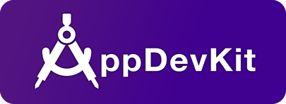
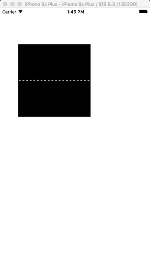
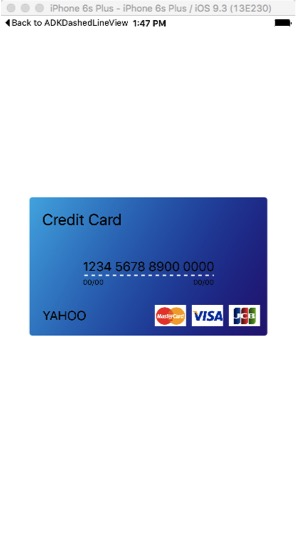
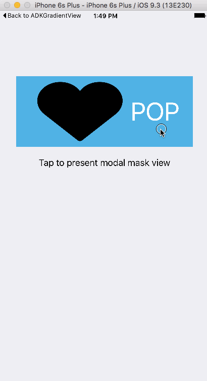
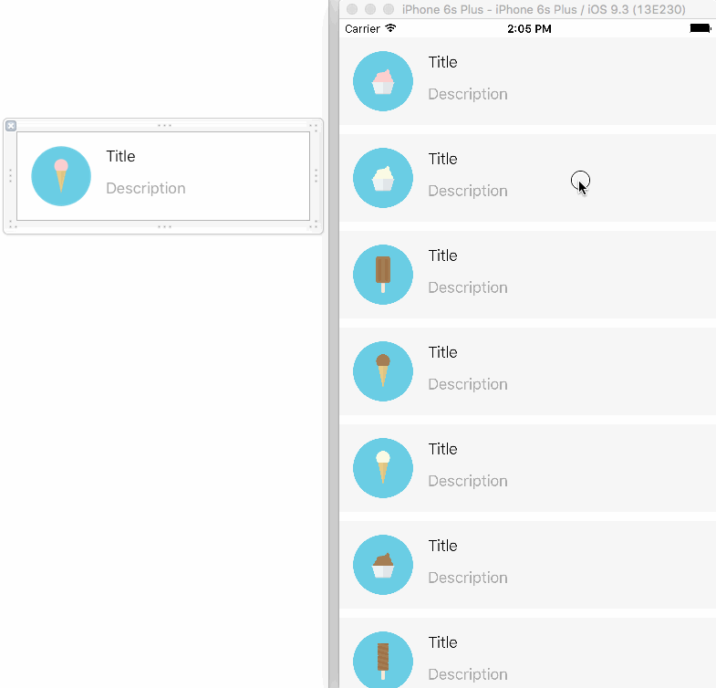
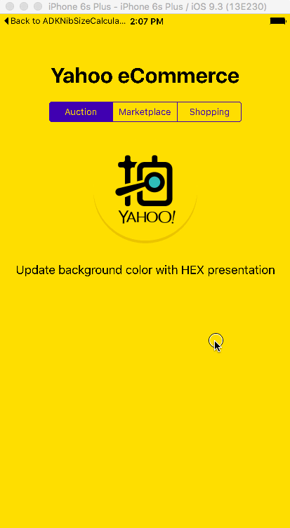
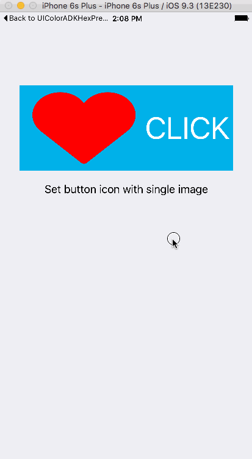
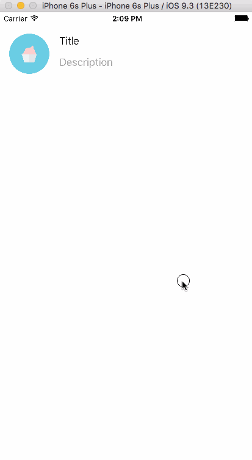
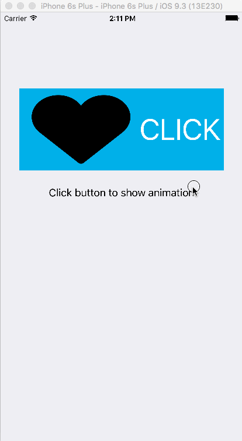
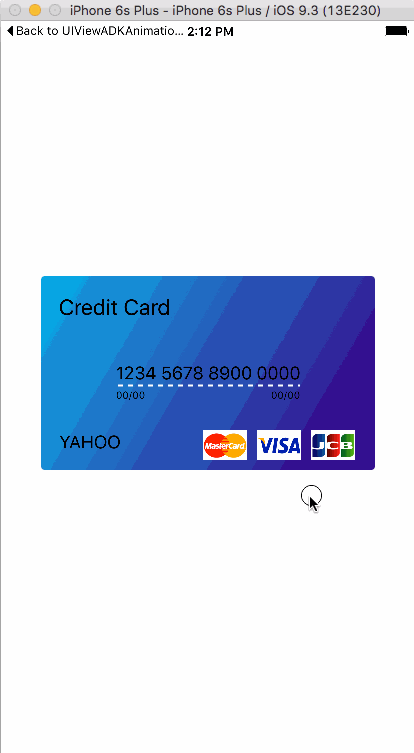

# AppDevKit Learning Materials

AppDevKit is an iOS development library that provides developers with useful features to 
fulfill their everyday iOS app development needs.

AppDevKit has five major parts that include command, user interfaces, animations, image view, and list view support libraries. AppDevKit could be installed by CocoaPods. Please feel welcome to use AppDevKit in your iOS projects as it is licensed under the permissive open source BSD license. More information about AppDevKit is [here](https://github.com/yahoo/AppDevKit).
 
This REPO includes learning materials of AppDevKit. If you want to use these materials for your training, you're free to use. 

## How to use this materials

### Index of materials
  - **Presentations** > Presentation deck for AppDevKit training.
  - **Templates** > Templates for AppDevKit training. They're designed for coding exercise. Every template is setted up basic sample. The purpose is making attender to do practice easer. 
  - **Tutorials** > Accomplished pratice sample project from templates.

### Practice sample

  - **ADKDashedLineView** > Practiced project for demostrate ADKDashedLineView.

  

  - **ADKGradientView** > Practiced project for demostrate ADKGradientView.

  

  - **ADKModalMaskView** > Practiced project for demostrate ADKModalMaskView.

  

  - **ADKNibSizeCalculator** > Practiced project for demostrate ADKNibSizeCalculator.

  

  - **UIColorADKHexPresentation** > Practiced project for demostrate UIColorADKHexPresentation.
  
  

  - **UIImageADKImageFilter** > Practiced project for demostrate UIImage+ADKImageFilter.
  
  
  
  - **UIScrollViewADKPullToRefreshView** > Practiced project for demostrate UIScrollView+ADKPullToRefreshView.
  
  
  
  - **UIViewADKAnimationMacro** > Practiced project for demostrate UIView+ADKAnimationMacro.
  
  
  
  - **UIViewADKAutoLayoutSupport** > Practiced project for demostrate UIView+ADKAutoLayoutSupport.
  
  
  
  - **ADKonSwift** > Demonstrate for using Swift with AppDevKit.
